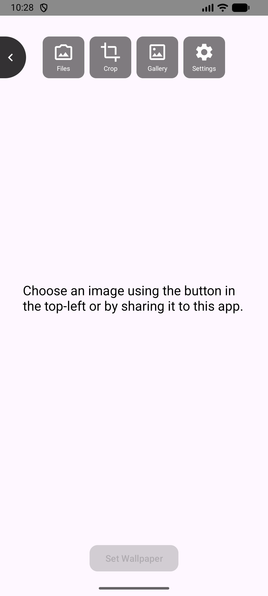
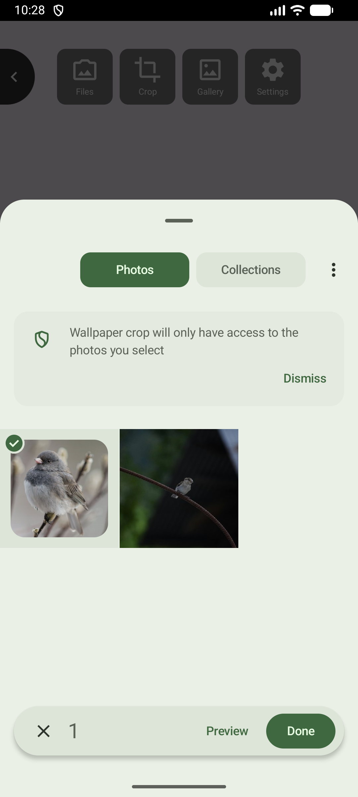
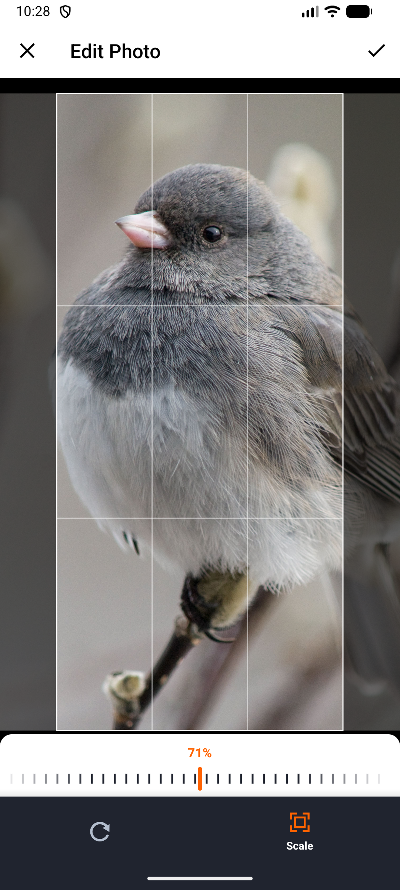
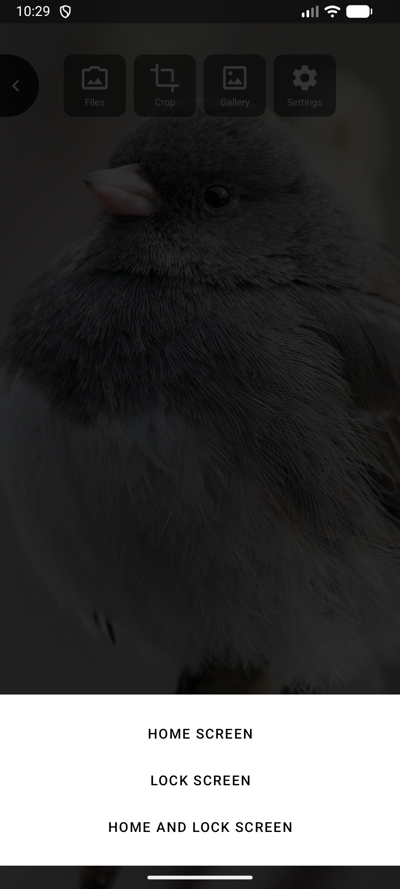
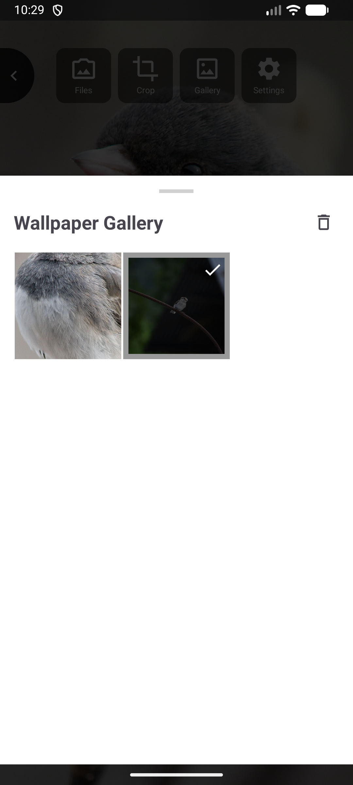
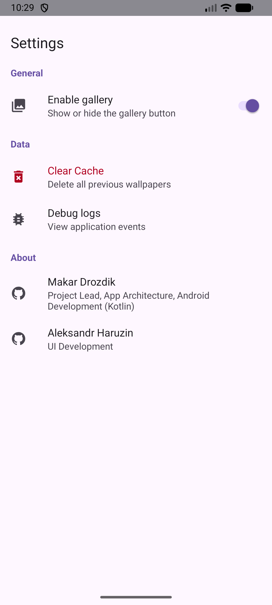

# Wallpaper Crop

A lightweight Android app for cropping wallpapers — useful as a fallback when your device's native
wallpaper picker is limited or unavailable.

## Features

- **Backup wallpaper setup** — Apply wallpapers using this app if the standard method isn't working.
- **In-app media browser** — Browse and select any image from your device's gallery without leaving the app.
- **Share image** — Share an image from any app, such as your gallery, browser, or file manager, directly into this app.
- **Set as-is** — Apply the selected image as your wallpaper in one tap
- **Crop before setting** — Use the built-in crop tool to perfectly fit the image to your screen.
- **Saved images gallery** — Applied images are automatically saved to the app's internal gallery,
  making it easy to switch between your favorite wallpapers.

## Screenshots

  
  &nbsp;
  
  &nbsp;
  
  &nbsp;
  
  &nbsp;
  
  &nbsp;
  
  &nbsp;
  

## License
    Copyright 2026, Makar
    
    Licensed for reference purposes only.
    This software may not be copied, modified, distributed, or used
    in whole or in part without explicit written permission from the author.
    
    This software does not collect, store, or transfer any user data
    to the author or third parties.